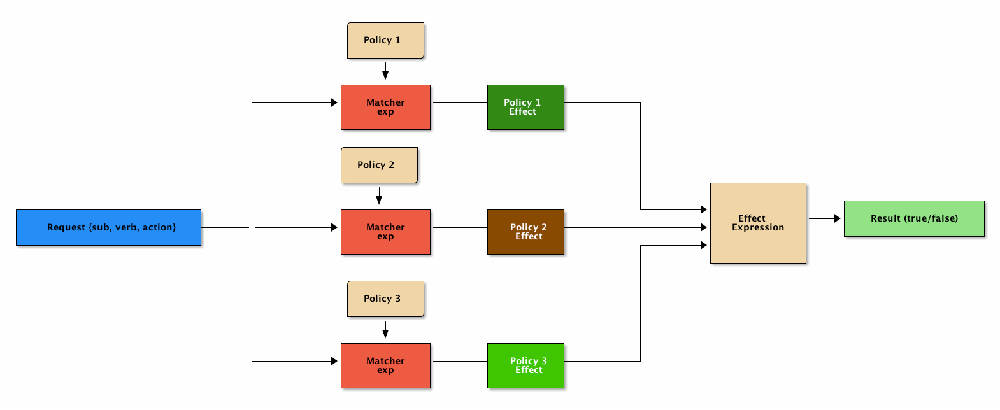

# 用户服务

### 启动步骤
1. 启动DiscoveryApplication
2. 启动UserApplication
3. [访问Swagger API文档](http://192.168.3.65:8080/swagger-ui.html#/)

### 权限系统
[jcasbin源码](https://github.com/casbin/jcasbin)
[参考文档](https://www.cnblogs.com/wang_yb/archive/2018/11/20/9987397.html)

### casbin-权限管理
#### 概要
权限管理几乎是每个系统或者服务都会直接或者间接涉及的部分. 权限管理保障了资源(大部分时候就是数据)的安全, 权限管理一般都是和业务强关联, 每当有新的业务或者业务变化时, 不能将精力完全放在业务实现上, 权限的调整往往耗费大量的精力.

其实, 权限的本质没有那么复杂, 只是对访问的控制而已, 有一套完善的访问控制接口, 再加上简单的权限模型. 权限模型之所以能够简单, 就是因为权限管理本身并不复杂, 只是在和具体业务结合时, 出现了各种各样的访问控制场景, 才显得复杂.

#### PERM 模型
PERM(Policy, Effect, Request, Matchers)模型很简单, 但是反映了权限的本质 – 访问控制

Policy: 定义权限的规则
Effect: 定义组合了多个 Policy 之后的结果, allow/deny
Request: 访问请求, 也就是谁想操作什么
Matcher: 判断 Request 是否满足 Policy
PERM 模型


#### casbin 权限库
casbin 使用了 PERM 模型来表达权限, 并且提供了简单直接的 API.

#### 核心概念
model file
用来定义具体的权限模型, 目前支持的模型基本覆盖了常见的所有场景:

ACL
ACL with superuser
ACL without users
ACL without resources
RBAC
RBAC with resource roles
RBAC with domains/tenants
ABAC
……
#### model file 定义语法
casbin 是基于 PERM 的, 所有 model file 中主要就是定义 PERM 4 个部分.

1. Request definition
```shell
[request_definition]
r = sub, obj, act
```

分别表示 request 中的

accessing entity (Subject)
accessed resource (Object)
the access method (Action)

2. Policy definition
```shell
[policy_definition]
p = sub, obj, act
p2 = sub, act
```

定义的每一行称为 policy rule, p, p2 是 policy rule 的名字. p2 定义的是 sub 所有的资源都能执行 act

3. Policy effect
```shell
[policy_effect]
e = some(where (p.eft == allow))
```

上面表示有任意一条 policy rule 满足, 则最终结果为 allow

4. Matchers
```shell
[matchers]
m = r.sub == p.sub && r.obj == p.obj && r.act == p.act
```

定义了 request 和 policy 匹配的方式, p.eft 是 allow 还是 deny, 就是基于此来决定的

5. Role
```shell
[role_definition]
g = _, _
g2 = _, _
g3 = _, _, _
```

g, g2, g3 表示不同的 RBAC 体系, _, _ 表示用户和角色 _, _, _ 表示用户, 角色, 域(也就是租户)

#### policy file
定义具体的策略, 权限的检查就是基于定义的 model file 和 policy file 来完成的.

相对于 model file 定义规则, policy file 中定义的就是具体的内容.

#### RBAC 示例
##### 定义 model file
```shell
[request_definition]
r = sub, obj, act

[policy_definition]
p = sub, obj, act

[role_definition]
g = _, _

[policy_effect]
e = some(where (p.eft == allow))

[matchers]
m = g(r.sub, p.sub) && r.obj == p.obj && r.act == p.act

```

##### 定义 policy file
```shell
p, superAdmin, project, read
p, superAdmin, project, write
p, admin, project, read
p, admin, project, write
p, admin, asse, read
p, admin, asse, write
p, zhuangjia, project, write
p, zhuangjia, asse, write
p, shangshang, project, read
p, shangshang, asse, read

g, quyuan, admin
g, wenyin, zhuangjia
```

##### 测试代码
```shell
package rbac

import (
"fmt"
"log"

"github.com/casbin/casbin"
)

func TestRBAC() {
e := casbin.NewEnforcer("rbac/rbac.conf", "rbac/rbac.csv")

fmt.Printf("RBAC test start\n") // output for debug

// superAdmin
if e.Enforce("superAdmin", "project", "read") {
log.Println("superAdmin can read project")
} else {
log.Fatal("ERROR: superAdmin can not read project")
}

if e.Enforce("superAdmin", "project", "write") {
log.Println("superAdmin can write project")
} else {
log.Fatal("ERROR: superAdmin can not write project")
}

// admin
if e.Enforce("quyuan", "project", "read") {
log.Println("quyuan can read project")
} else {
log.Fatal("ERROR: quyuan can not read project")
}

if e.Enforce("quyuan", "project", "write") {
log.Println("quyuan can write project")
} else {
log.Fatal("ERROR: quyuan can not write project")
}

if e.Enforce("quyuan", "asse", "read") {
log.Println("quyuan can read asse")
} else {
log.Fatal("ERROR: quyuan can not read asse")
}

if e.Enforce("quyuan", "asse", "write") {
log.Println("quyuan can write asse")
} else {
log.Fatal("ERROR: quyuan can not write asse")
}

// zhuangjia
if e.Enforce("wenyin", "project", "read") {
log.Fatal("ERROR: wenyin can read project")
} else {
log.Println("wenyin can not read project")
}

if e.Enforce("wenyin", "project", "write") {
log.Println("wenyin can write project")
} else {
log.Fatal("ERROR: wenyin can not write project")
}

if e.Enforce("wenyin", "asse", "read") {
log.Fatal("ERROR: wenyin can read asse")
} else {
log.Println("wenyin can not read asse")
}

if e.Enforce("wenyin", "asse", "write") {
log.Println("wenyin can write asse")
} else {
log.Fatal("ERROR: wenyin can not write asse")
}

// shangshang
if e.Enforce("shangshang", "project", "read") {
log.Println("shangshang can read project")
} else {
log.Fatal("ERROR: shangshang can not read project")
}

if e.Enforce("shangshang", "project", "write") {
log.Fatal("ERROR: shangshang can write project")
} else {
log.Println("shangshang can not write project")
}

if e.Enforce("shangshang", "asse", "read") {
log.Println("shangshang can read asse")
} else {
log.Fatal("ERROR: shangshang can not read asse")
}

if e.Enforce("shangshang", "asse", "write") {
log.Fatal("ERROR: shangshang can write asse")
} else {
log.Println("shangshang can not write asse")
}
}
```

#### 多租户示例
##### 定义 model file
```shell
[request_definition]
r = sub, dom, obj, act

[policy_definition]
p = sub, dom, obj, act

[role_definition]
g = _, _, _

[policy_effect]
e = some(where (p.eft == allow))

[matchers]
m = g(r.sub, p.sub, r.dom) && r.dom == p.dom && r.obj == p.obj && r.act == p.act
定义 policy file
p, superAdmin, gy, project, read
p, superAdmin, gy, project, write
p, superAdmin, jn, project, read
p, superAdmin, jn, project, write
p, admin, gy, project, read
p, admin, gy, project, write
p, admin, jn, asse, read
p, admin, jn, asse, write
p, zhuangjia, jn, project, write
p, zhuangjia, gy, asse, write

g, quyuan, admin, gy
g, quyuan, admin, jn
g, wenyin, zhuangjia, gy
g, shangshang, zhuangjia, jn
```

测试代码
```shell
package tenants

import (
"fmt"
"log"

"github.com/casbin/casbin"
)

// TestTenants test tenants
func TestTenants() {
e := casbin.NewEnforcer("tenants/tenants.conf", "tenants/tenants.csv")

fmt.Printf("RBAC TENANTS test start\n") // output for debug

// superAdmin
if e.Enforce("superAdmin", "gy", "project", "read") {
log.Println("superAdmin can read project in gy")
} else {
log.Fatal("ERROR: superAdmin can not read project in gy")
}

if e.Enforce("superAdmin", "gy", "project", "write") {
log.Println("superAdmin can write project in gy")
} else {
log.Fatal("ERROR: superAdmin can not write project in gy")
}

if e.Enforce("superAdmin", "jn", "project", "read") {
log.Println("superAdmin can read project in jn")
} else {
log.Fatal("ERROR: superAdmin can not read project in jn")
}

if e.Enforce("superAdmin", "jn", "project", "write") {
log.Println("superAdmin can write project in jn")
} else {
log.Fatal("ERROR: superAdmin can not write project in jn")
}

// admin
if e.Enforce("quyuan", "gy", "project", "read") {
log.Println("quyuan can read project in gy")
} else {
log.Fatal("ERROR: quyuan can not read project in gy")
}

if e.Enforce("quyuan", "gy", "project", "write") {
log.Println("quyuan can write project in gy")
} else {
log.Fatal("ERROR: quyuan can not write project in gy")
}

if e.Enforce("quyuan", "jn", "project", "read") {
log.Fatal("ERROR: quyuan can read project in jn")
} else {
log.Println("quyuan can not read project in jn")
}

if e.Enforce("quyuan", "jn", "project", "write") {
log.Fatal("ERROR: quyuan can write project in jn")
} else {
log.Println("quyuan can not write project in jn")
}

if e.Enforce("quyuan", "gy", "asse", "read") {
log.Fatal("ERROR: quyuan can read asse in gy")
} else {
log.Println("quyuan can not read asse in gy")
}

if e.Enforce("quyuan", "gy", "asse", "write") {
log.Fatal("ERROR: quyuan can write asse in gy")
} else {
log.Println("quyuan can not write asse in gy")
}

if e.Enforce("quyuan", "jn", "asse", "read") {
log.Println("quyuan can read asse in jn")
} else {
log.Fatal("ERROR: quyuan can not read asse in jn")
}

if e.Enforce("quyuan", "jn", "asse", "write") {
log.Println("quyuan can write asse in jn")
} else {
log.Fatal("ERROR: quyuan can not write asse in jn")
}

// wenyin
if e.Enforce("wenyin", "gy", "asse", "write") {
log.Println("wenyin can write asse in gy")
} else {
log.Fatal("ERROR: wenyin can not write asse in gy")
}

if e.Enforce("wenyin", "jn", "asse", "write") {
log.Fatal("ERROR: wenyin can write asse in jn")
} else {
log.Println("wenyin can not write asse in jn")
}

// shangshang
if e.Enforce("shangshang", "jn", "project", "write") {
log.Println("shangshang can write project in jn")
} else {
log.Fatal("ERROR: shangshang can not write project in jn")
}

if e.Enforce("shangshang", "gy", "project", "write") {
log.Fatal("ERROR: shangshang can write project in gy")
} else {
log.Println("shangshang can not write project in gy")
}
}
```

#### 总结
casbin 权限管理库比较简单, 易上手, 但是它的功能却不简单, 支持了目前主流的所有权限管理场景. 在使用上, model file 和 poclicy file 的定义也简单明了, 抽象出了权限管理最本质的东西.

将具体业务中的权限要求映射到 casbin 中 model file, 就可以借助 casbin 的 API, 快速的实现权限管理.
